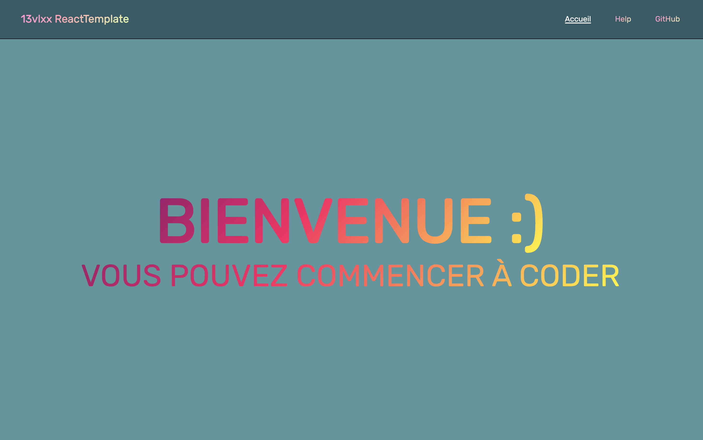

# React simple template with routes and axios

## Available Scripts

In the project directory, you can run:

### `npm i react-router-dom sass`

For install react-router-dom sass

### `npm i axios`

For install axios (good for api's)

### `npm start`

For start a server

### `npm i`

For install `node_modules` in directory
